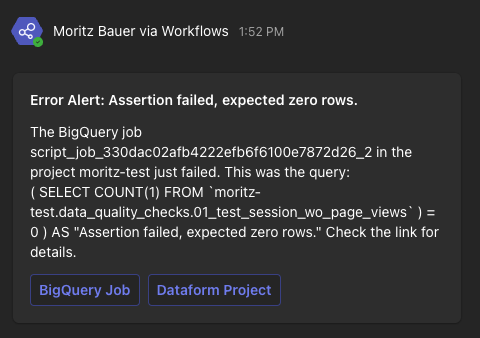
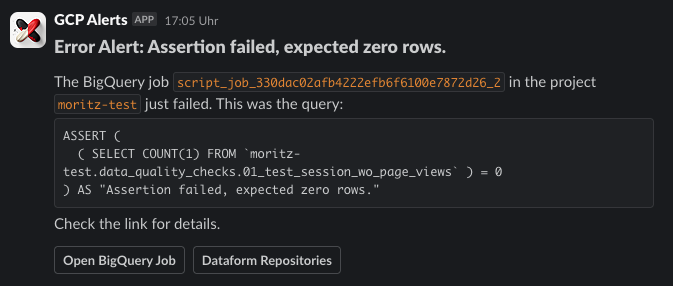

# Dataform Error Alert to Slack

This Node.js application is designed to send alerts to a Slack- or Microsoft Teams Channel when an assertion in Dataform fails. The application is deployed as a Google Cloud Functions and listens for Pub/Sub messages indicating a job error, then sends a formatted message with details about the error for debugging purposes.

## Microsoft Teams Message
 

## Slack Message



### Quick Start
1. Clone this repository and make sure you have installed [Terraform](https://developer.hashicorp.com/terraform/tutorials/gcp-get-started/install-cli).
2. Authenticate with Application Default Credentials - Setup [Application Default Credentials](https://cloud.google.com/docs/authentication/provide-credentials-adc#local-user-cred).
3. Change the variables inside terraform.tfvars.example to suit your needs and rename the file to terraform.tfvars. Make sure you have created the SGTM Container already to retrieve the container config.
4. Run `terraform init` to initialize the repository and `terraform apply` the infrastructure will be built on GCP

## Requirements

- `@google-cloud/functions-framework` package
- [`terraform`](https://www.terraform.io/) package
- A Slack / Microsoft Teams webhook URL - You need to create a Slack App for your workspace to obtain this or create a Workflow for Microsoft Teams Channel
- Log Router/Pub/Sub topic - Set up a log router for the failed assertion with a Pub/Sub as the destination

## Filter Log Router
Create a log router with the following filter with a Pub/Sub topic as destination.
```js
severity=ERROR
resource.type="bigquery_resource"
protoPayload.methodName="jobservice.getqueryresults"
protoPayload.status.message="Assertion failed, expected zero rows." 
```
